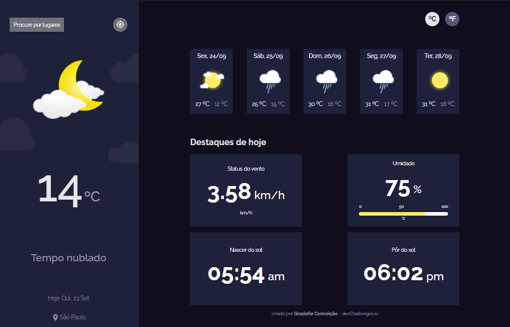
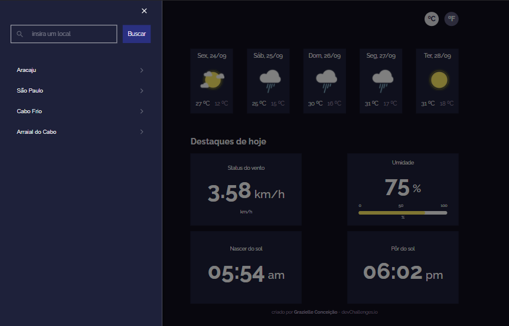

# Challenge Weather App

Este projeto foi desenvolvido com base no desafio Weather App do [devChallenges](https://devchallenges.io/challenges/mM1UIenRhK808W8qmLWv).

## :computer: Tecnologias Utilizadas
### * [ReactJS](https://reactjs.org/)
### * [TypeScript](https://www.typescriptlang.org/)

## :closed_book: Bibliotecas Utilizadas
### * [Styled Component](https://styled-components.com/)
### * [Axios](https://github.com/axios/axios)
### * [Material UI](https://mui.com/pt/)
### * [Formsy](https://github.com/christianalfoni/formsy-react)
### * [Prettier](https://prettier.io/)
### * [ESlint](https://eslint.org/)

## Telas do Projeto

    
    

## :rocket: Funcionalidade
Aplicação feita com o intuito de informar o usuário as condições climáticas da cidade de sua escolha.

### :computer: Como instalar?
* Clone este repositório, entre na pasta do projeto e digite o comando ``yarn install`` ou apenas ``yarn`` no seu terminal. 

* Ao finalizar, digite ``yarn start`` e acesse [http://localhost:3000](http://localhost:3000) para visualizar a aplicação funcionando no seu navegador.

## Desenvolvimento
Projeto feito com carinho por [Grazielle Conceição](https://www.linkedin.com/in/grazielle-concei%C3%A7%C3%A3o-680b29161/) 🚀